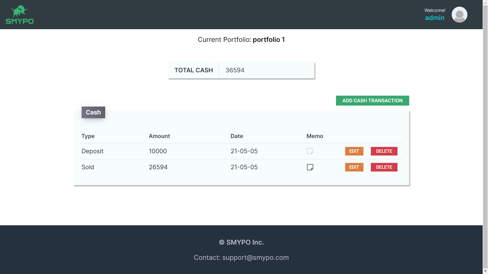

# Login Page

<figure>

<figcaption align="center">Login page</figcaption>
</figure>

# Signup Page

<figure>

<figcaption align="center">Signup page</figcaption>
</figure>

# Dashboard Page

<figure>

<figcaption align="center">Dashboard page 1 - showing returns, distribution by value bar chart</figcaption>
</figure>
<figure>
 

<figcaption align="center">Dashboard page 2 - showing distribution by sector pie chart</figcaption>
</figure>
 

<figcaption align="center">Dashboard page 3 - showing asset history line chart</figcaption>
</figure>

# Stock list Page

<figcaption align="center">Stock list page 1 - showing current holding stock list</figcaption>
</figure>
 

<figcaption align="center">Stock list page 2 - showing previously held stock list</figcaption>
</figure>
 

<figcaption align="center">Stock list page 3 - Add a stock transaction example</figcaption>
</figure>
 

<figcaption align="center">Stock list page 4 - Auto-complete function of the add a stock transaction example</figcaption>
</figure>

# Realized Stock List Page

<figcaption align="center">Realized stock list page</figcaption>
</figure>

# Portfolio List Page

<figcaption align="center">Portfolio list page - showing the account's portfolio list</figcaption>
</figure>
 

<figcaption align="center">Portfolio list page - Add a new portfolio example</figcaption>
</figure>

# Cash List Page

<figcaption align="center">Cash list page</figcaption>
</figure>
 

<figcaption align="center">Cash list page - showing add a new cash transaction example</figcaption>
</figure>
