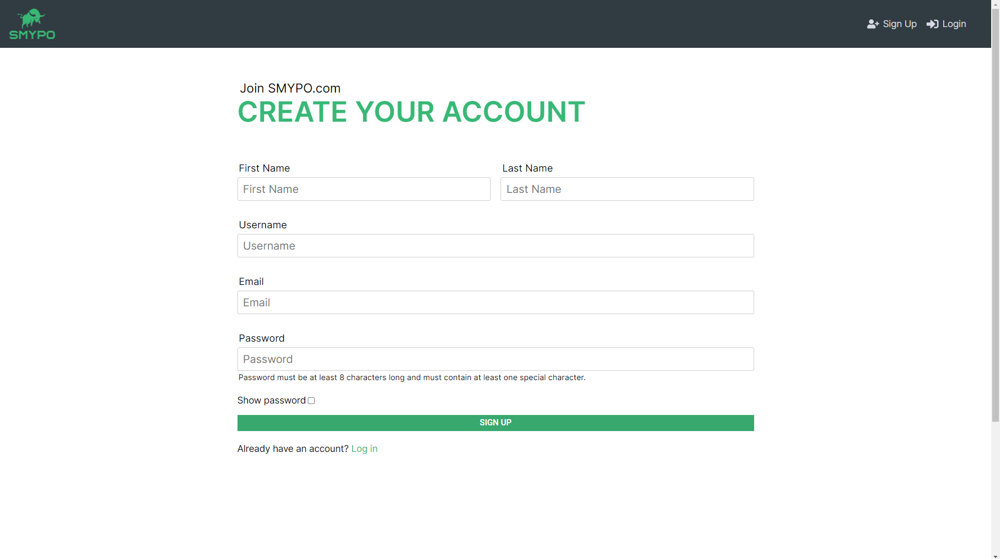

# Login Page

Login page

# Signup Page

Signup Page

# Profile Page

Profile Page 1 - Editing user's avatar and bio info feature

Profile Page 2 - Editing password and delete account feature

# Dashboard Page

Dashboard page 1 - showing returns, distribution by value bar chart

Dashboard page 2 - showing distribution by sector pie chart

Dashboard page 3 - showing asset history line chart

# Stock list Page

Stock list page 1 - showing current holding stock list

Stock list page 2 - showing previously held stock list

Stock list page 3 - Add a stock transaction example

Stock list page 4 - Auto-complete function of the add a stock transaction example

# Realized Stock List Page

Realized stock list page

# Portfolio List Page

Portfolio list page - showing the account's portfolio list

Portfolio list page - Add a new portfolio example

# Cash List Page

Cash list page - showing add a new cash transaction example

Realized stock list page

